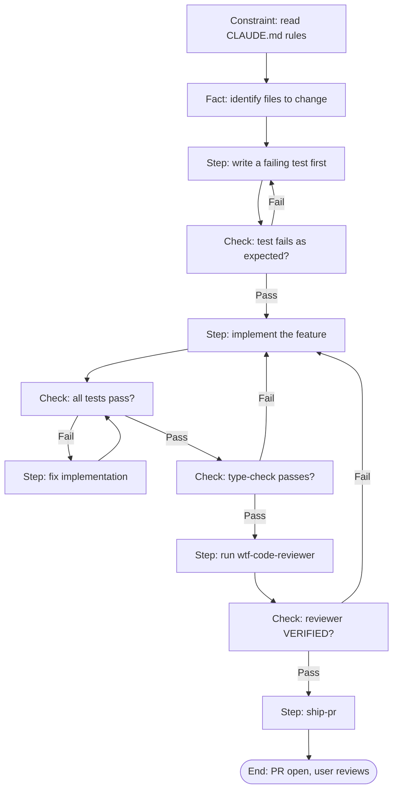

# BRAID Mental Model

> **BRAID** — *Bounded Reasoning for Autonomous Inference and Decisions*.
> Source: arXiv 2512.15959. We adapted it as the reasoning backbone for every non-trivial task.

## Why

The most common failure of an agent is **error compounding**: it makes a mistake in one step,
feeds the bad output into the next step, and the error grows. A flat to-do list does not fix this,
because the list never says *what happens when a step fails*.

BRAID fixes this by structuring a task as a graph of four node types, where **failure is an edge,
not a dead end**.

## Node taxonomy

- **Constraint** — a rule that comes from context (CLAUDE.md, a reference file, a spec).
- **Fact** — something known to be true (a file path, an API shape, a measured value).
- **Step** — one atomic action (write a test, implement, run a command).
- **Check** — a verification with **exactly two outgoing edges: Pass and Fail**.

## The loop is the retry

The trick is the **Fail edge**. When a Check fails, the model does **not** "retry with the same
input". It returns to an earlier Step, produces a *different* input, and checks again. The loop
*is* the retry mechanism. We never set `max_retry: 3` — the graph structure already bounds it.

## Two-phase execution

1. **Plan** — a planner (`braid-plan` skill) emits the graph once and caches it to
   `.local-artifacts/braid/<task-slug>.mmd`.
2. **Solve** — the `braid-solver` agent traverses the cached graph node by node.

We do **not** regenerate the graph when the same task returns. The graph is scaffolding.

## When to draw a graph

Draw it for: 3+ file refactors, multi-hypothesis debugging, architecture decisions.
Skip the drawing for one-liners — but still apply the *mental* model: name the constraints, name
the facts, name the check criterion, and define what happens on failure.

## Anti-stale rule

Never trust recall. Memory is a snapshot; rules, configs and APIs change. Before recommending a
file, function or flag, **read the real file or run the real command**.
