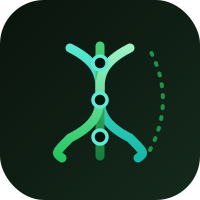

<h3 align="center">
   
  
   
  Sklent
   
</h3>

Yeniden kullanılabilir bir <strong>Claude Code agent bootstrap</strong>'ı — agent'lar, skill'ler, reference'lar ve hook'lar; <strong>BRAID</strong> akıl yürütme modeli etrafında kurgulanmış. Tek bir geliştirici production kodunu disiplinle üretip denetlesin diye. Herhangi bir projeye eklenebilir. İçinde tam bir e-ticaret örneği gelir.

· <a href="./README.md">🇬🇧 English</a>
· <a href="./examples/e-commerce">🛒 E-ticaret örneği</a>
· <a href="./CONTRIBUTING.md">Katkı</a>
· <a href="./LICENSE">Lisans</a>

## 📖 Sklent nedir?

Sklent bir uygulama **değildir**. Uygulamaları **üreten ve denetleyen ekosistemdir**: proje
kurallarını "umut etmek" yerine mekanik olarak zorunlu kılan Claude Code agent'ları, skill'leri,
reference'ları ve hook'ları.

Tüm mesele [`.claude/`](.claude) altında. Gerçek bir şey üzerinde çalıştığını kanıtlamak için repo,
[`examples/e-commerce/`](examples/e-commerce) altında markasız, full-stack bir e-ticaret platformu
örneğiyle birlikte gelir.

## 🧠 BRAID akıl yürütme modeli

Sklent'in imzası. Bir agent'ın en kötü hatası **hata büyümesidir**: bir adımdaki hata sonraki
adımı besler. Düz bir yapılacaklar listesi "başarısız olunca ne olacak" demez.

BRAID (*Bounded Reasoning for Autonomous Inference and Decisions*, arXiv 2512.15959) bir işi dört
düğüm tipinden oluşan bir grafiğe böler — **Constraint**, **Fact**, **Step**, **Check** — ve her
Check'in tam iki çıkışı vardır: **Pass** ve **Fail**. Fail kenarı önceki bir Step'e döner; döngünün
kendisi retry'dır. Bkz. [`.claude/references/braid-mental-model.md`](.claude/references/braid-mental-model.md).

## 🤖 Agent ekosistemi

- **`agents/`** — `wtf-code-reviewer` (dispatcher) diff'i `wtf-go`, `wtf-js-react`,
  `wtf-security`, `wtf-ux-playwright`'a paralel yönlendirir; ayrıca `braid-solver`,
  `constants-guard`, `issue-auditor`.
- **`skills/`** — `braid-plan`, `spec-driven-development`, `coverage-gate`, `playwright-snapshot`,
  `ship-pr`, `issue-create`, `security-pentest` (web/api/network), `intended-vs-implemented`.
- **`references/`** — dilden bağımsız kodlama, backend/frontend/güvenlik standartları, git-flow ve
  BRAID modeli — reviewer'ların okuduğu ret kriterleri.
- **`hooks/`** — kuralları atlanamaz kılan kabuk script'leri: aliaslı Go import yok, korumalı
  branch'e doğrudan commit yok, agent merge yok, 2 satırlık yorum yok, commit öncesi CI-aynası
  doğrulama.

## 🛒 Örnek: Vela Commerce

Tek `docker compose up` ile çalışan gerçek, markasız bir e-ticaret platformu: Go 1.25 API
(Gin + GORM + Postgres), Next.js storefront + admin (TR/EN), Iyzico 3D Secure sandbox, ChromaDB
RAG ürün metni, GIB e-Arşiv fatura proxy'si, marketplace iskeletleri. Bkz.
[`examples/e-commerce/`](examples/e-commerce).

## 🔍 Fikirler nereden geliyor

Açık kaynaktan uyarlandı; atıf her agent/skill içinde:

- [Claude Code — Subagents](https://docs.claude.com/en/docs/claude-code/sub-agents)
- [Claude Code — Agent Skills](https://docs.claude.com/en/docs/claude-code/skills)
- [Claude Code — Hooks](https://docs.claude.com/en/docs/claude-code/hooks)
- [Anthropic Cookbook](https://github.com/anthropics/anthropic-cookbook)
- [mukul975/Anthropic-Cybersecurity-Skills](https://github.com/mukul975/Anthropic-Cybersecurity-Skills) — `security-pentest` ilhamı
- [phuryn/pm-skills](https://github.com/phuryn/pm-skills) — `intended-vs-implemented` ilhamı
- [BRAID (arXiv 2512.15959)](https://arxiv.org/abs/2512.15959)

## 🔑 Lisans

MIT — bkz. [LICENSE](./LICENSE).
